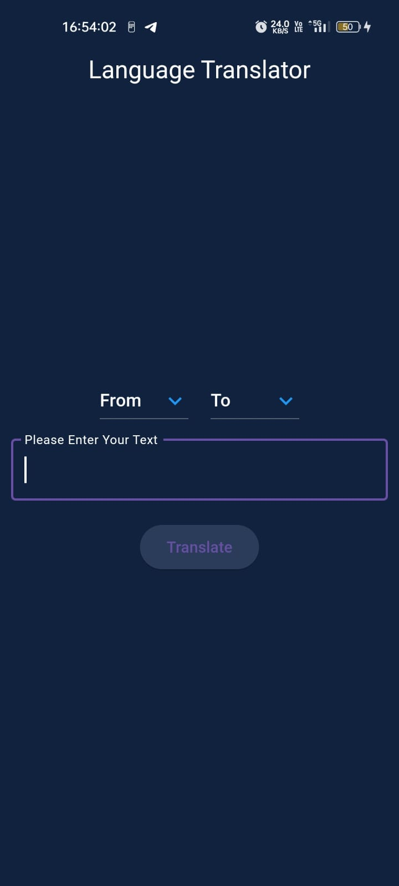
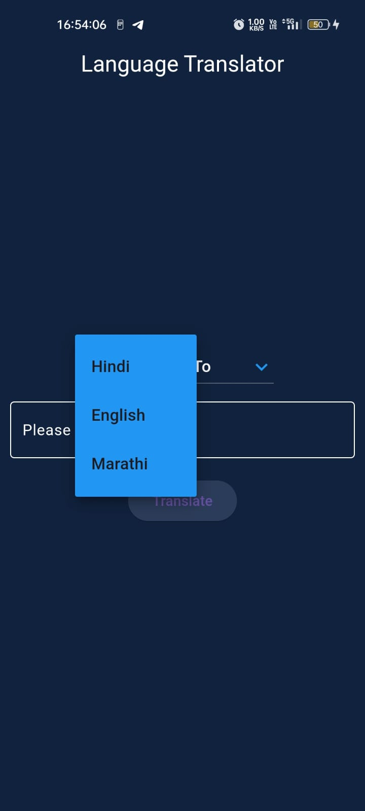
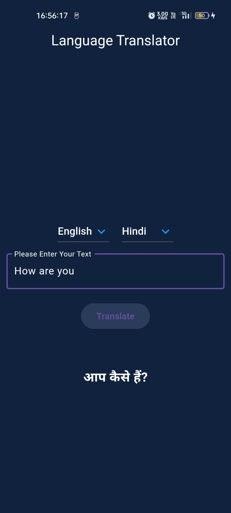
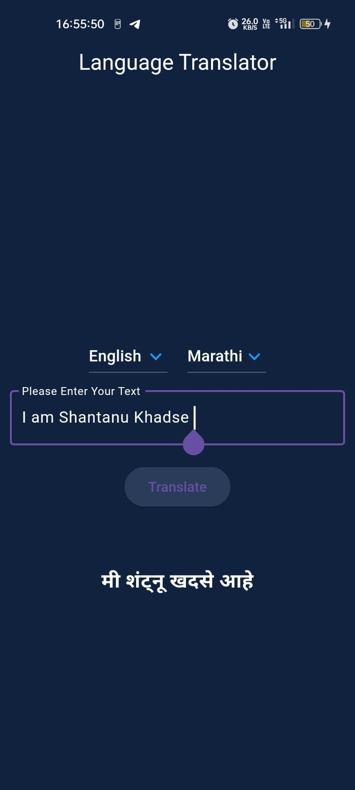

# 🌐 EasyTranslate 
EasyTranslate : A language translator app simple yet powerful Flutter application to translate text between different languages using Google Translator.

## ✨ Features
  - 🌍 Translate text between English, Hindi, and Marathi.
  - 🖥️ Simple and user-friendly interface.
  - ⏱️ Real-time translation results.

## 📋 Usage
  - Select the source language from the first dropdown menu.
  - Select the target language from the second dropdown menu.
  - Enter the text you want to translate in the text field.
  - Press the 'Translate' button to get the translated text.

## 📚 Dependencies
  - Flutter: The Flutter framework.
  - Translator: A package for using Google Translator.

## 📸 Screenshots

  
  
  
  

## 👤 Author

 ### Shantanu Khadse
  
  GitHub: [ShantanuKH](https://github.com/ShantanuKH)
  
  Email: shantanukhadse784@gmail.com  
  
  LinkedIn: [shantanukhadse](https://www.linkedin.com/in/shantanu-khadse-a62585230/)
